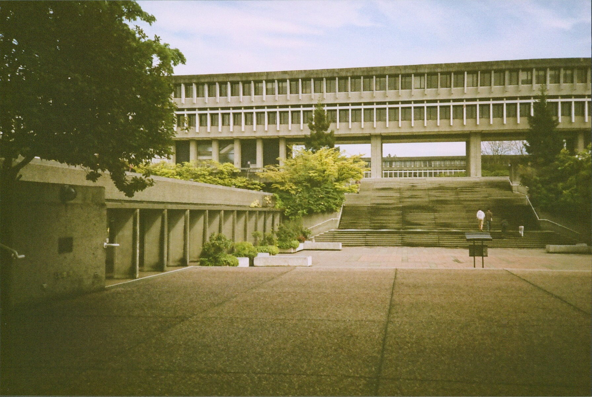
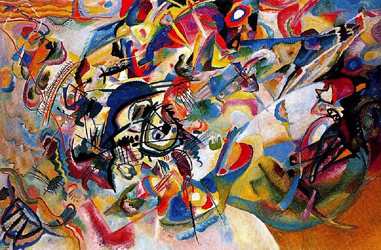
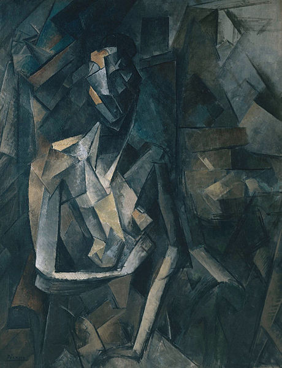
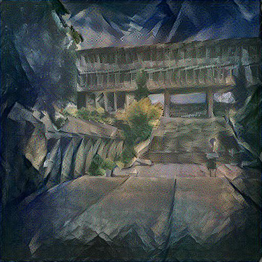

# A Matlab Implementation of Neural Style Transfer
> Neural Style Transfer (NST) is an algorithm that creates an image by combining the stylistic features of a piece of artwork with the content features of a photograph. The defining characteristic of NST which sets it apart from other image stylization techniques is the use of Deep Neural Networks trained for image recognition. First derived in 2016 by Leon Gatys and Matthias Bethge, the algorthm uses a single neural network to extract and recombine the content of one image and the style of another. The original paper that describe the algorithm can be found [here](https://ui.adsabs.harvard.edu/abs/2015arXiv150806576G) 

## Table of contents
* [General info](#general-info)
* [Screenshots](#screenshots)
* [Technologies](#technologies)
* [Setup](#setup)
* [Status](#status)

## General Info
The goal of this project was to build a working implementation of the NST model that faithfully produced results equivalent to those shown in the original paper by Gatys et al. Many implementations of this model already exist. If you are looking for such an application, one of the best is given by https://github.com/jcjohnson/neural-style. Here, Justin Johnson provides a robust and efficient version of the style transfer algorithm and even implements many of the modifications that were added to the original algorithm after its release. 

One of the side-effects of working in Matlab is that we have to implement our own backpropagation pass. The reason for this is that the deep learning toolbox that comes installed with Matlab  only allows users to access gradients of an objective function that is a scalar function of the networks weights. This is an issue for style transfer applications as the objective we try to optimize is a function of the input of the network and the weights are fixed. Compare this to Tensorflow or Pytorch which can execute forward and backward passes of networks with arbitrary loss functions completely within their computational graphs. 


## Screenshots 
 #### Results 
 Some outputs 
 
 <p align="center">
   
</p>

<p align="center">
   
</p>

<p align="center">
   
</p>

## Technologies
If you want to try and use this repository on you local machine you will need the following:
* MatLab
* Microsoft Visual Studio C++ - For MEX-file compilation
* Nvidia Cuda - For GPU execution
* [OPTI Toolbox](https://www.inverseproblem.co.nz/OPTI/index.php/Solvers/L-BFGS-B) - For L-BFGS-B optimization
* MatConvNet - Compiled with GPU support


## Setup
Clone the repository to your working directory. Ensure that methods/, MatConvNet and OPTI are on your MatLab path. Make sure MatLab is using the correct compiler and you should be able to run NST_EXPERIMENTS_VGG.m. 

## Code Examples
Here I will go show how to set some of the parameters for NST:

Loading and sizing the input images. I recommend using 256 x 256 resolution for images. You can use 512 x 512 but it will take longer.

```matlab
style = 'images/polka_dots.jpg';
a = imread(style); %style source
a = imresize(a,[256,256]); %set image size

content = 'images/san-francisco.jpg';
p = imread(content); %content source
p = imresize(p,[256,256]); %set image size
```

Set the layers used for content and style representation. Only use relu layers. The variables content_weights and texture_weights control the emphasis of the content and style images respectively in the output

```matlab
%Target Parameters
content_layers = {'relu4_2'};
content_weights = 1e-04;
texture_layers = {'relu1_1','relu2_1','relu3_1','relu4_1'};
texture_weights = 1e-06*ones(1,length(texture_layers));
```

To see the names of each layer in the network enter the following at the MatLab command line

```matlab
>> net.Layers
```

## Status
Project is: Finished
