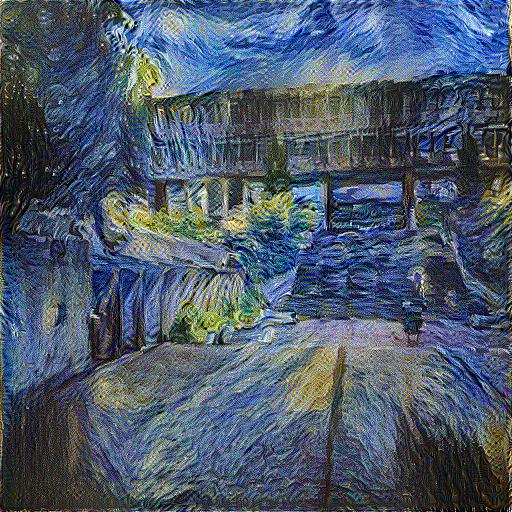
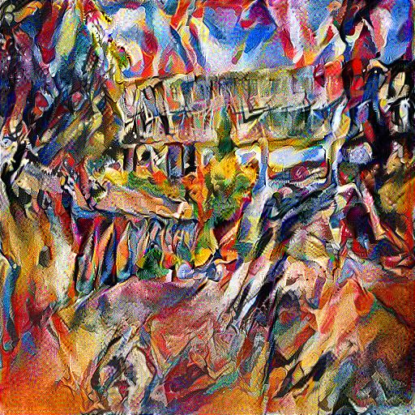

# A Matlab Implementation of Neural Style Transfer
> Neural Style Transfer (NST) is an algorithm that creates an image by combining the stylistic features of a piece of artwork with the content features of a photograph. The defining characteristic of NST which sets it apart from other image stylization techniques is the use of Deep Neural Networks trained for image recognition. First derived in 2016 by Leon Gatys and Matthias Bethge, the algorthm uses a single neural network to extract and recombine the content of one image and the style of another. The original paper that describe the algorithm can be found [here](https://ui.adsabs.harvard.edu/abs/2015arXiv150806576G) 

## Table of contents
* [General info](#general-info)
* [Screenshots](#screenshots)
* [Technologies](#technologies)
* [Setup](#setup)
* [Status](#status)
* [Inspiration](#inspiration)
* [Contact](#contact)

## General Info
The goal of this project was to gain a solid understanding of the NST model. To this end, we implement Gatys' algorithm from his paper "A Neural Algorithm of Artistic Style" and show that the results obtained are equally as interesting as those produced by the original paper. 

Others have done similar projects but one of the best implementations, is given by https://github.com/jcjohnson/neural-style. Here, Justin Johnson provides a robust and efficient version of the style transfer algorithm and even implements many of the modifications that were added to the original algorithm after its release. 

 We use the VGG19 network for this implementation. If you decide to delve into this repository you will notice that we have implemented our own backpropagation pass. This is a consequnece of using the Matlab environment. The reason being that the deep learning toolbox that comes installed with Matlab  only allows users to access gradients of an objective function that is a scalar function of the networks weights. This is an issue for style transfer applications as the objective we try to optimize is a function of the input of the network and the weights are fixed. Therefore, we must implement our own backpropagation pass outside of the Matlab API (see figure below). Compare this to Tensorflow or Pytorch which can execute forward and backward passes of networks with arbitrary loss functions completely within their computational graphs. 

## Screenshots
 #### Content Source
 
 #### Style Sources 

 #### Results
  

## Technologies
* Tech 1 - version 1.0
* Tech 2 - version 2.0
* Tech 3 - version 3.0

## Setup
Describe how to install / setup your local environement / add link to demo version.

## Code Examples
Show examples of usage:
`put-your-code-here`

## Features
List of features ready and TODOs for future development
* Awesome feature 1
* Awesome feature 2
* Awesome feature 3

To-do list:
* Wow improvement to be done 1
* Wow improvement to be done 2

## Status
Project is: _in progress_, _finished_, _no longer continue_ and why?

## Inspiration
Add here credits. Project inspired by..., based on...

## Contact
Created by [@flynerdpl](https://www.flynerd.pl/) - feel free to contact me!
